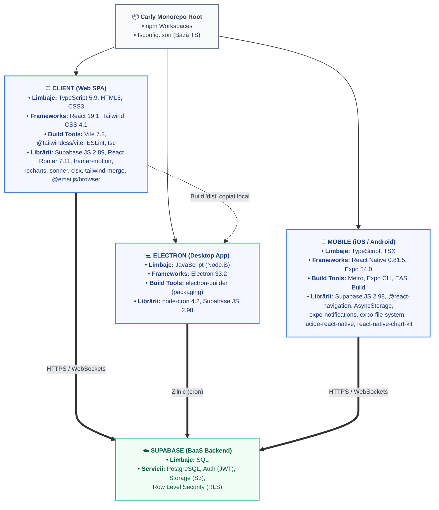

# Diagrama Tehnologică Carly — Ecosistem & Stack Tehnic

Pentru a optimiza spațiul și a oferi o documentație completă, am pregătit două versiuni ale diagramelor tehnologice Carly, cu legături directe către serviciile bazelor de date Supabase, urmate de o detaliere a stivei tehnice.

Puteți naviga între versiuni folosind caruselul de mai jos:

````carousel
### 📄 Varianta Compactă (Optimizată pentru A4 / Print)

Această schemă folosește noduri descriptive unificate pentru a reduce dimensiunile pe înălțime și lățime, fiind ideală pentru exportul sau imprimarea pe o singură pagină A4.



<!-- slide -->
### 🔍 Varianta Detaliată (Cu Subgrupe Structurate & Legături DB)

Această schemă extinsă vizualizează fiecare tehnologie ca un nod separat, organizat în subcategorii logice (Limbaje, Frameworks, Librării, Build Tools), cu legături directe de la modulele SDK client la serviciile bazelor de date.

```mermaid
flowchart TB
    %% Styling definitions
    classDef lang fill:#faf5ff,stroke:#a855f7,stroke-width:1.5px,color:#581c87;
    classDef fw fill:#eff6ff,stroke:#3b82f6,stroke-width:1.5px,color:#1e3a8a;
    classDef lib fill:#fdf2f8,stroke:#ec4899,stroke-width:1.5px,color:#701a75;
    classDef tool fill:#f8fafc,stroke:#64748b,stroke-width:1.5px,color:#334155;
    classDef db fill:#ecfdf5,stroke:#10b981,stroke-width:1.5px,color:#064e3b;

    %% Root Level
    subgraph Monorepo["📦 Carly Monorepo Root (npm workspaces)"]
        RootTS["tsconfig.json (Configurație TypeScript de bază)"]
        RootNPM["npm Workspaces (Gestionare dependențe comune)"]
    end

    %% Web Client Component
    subgraph WebClient["🌐 Client (Aplicație Web SPA)"]
        direction TB
        subgraph WebLanguages["Limbaje (Web)"]
            TS_Web["TypeScript 5.9 (Logic & Types)"]:::lang
            HTML_Web["HTML5 (Index Entry)"]:::lang
            CSS_Web["CSS3 (Tailwind v4 Styles)"]:::lang
        end
        subgraph WebFrameworks["Frameworks (Web)"]
            React_Web["React 19.1"]:::fw
            Tailwind_Web["Tailwind CSS 4.1"]:::fw
        end
        subgraph WebBuild["Build & Dev Tools (Web)"]
            Vite_Web["Vite 7.2 (Bundler & HMR)"]:::tool
            TailsVite["@tailwindcss/vite 4.1"]:::tool
            ESLint_Web["ESLint 9.39"]:::tool
            TSC_Web["tsc (Compilator TS)"]:::tool
        end
        subgraph WebLibs["Librării (Web)"]
            Supa_Web["@supabase/supabase-js 2.89 (Client DB/Auth)"]:::lib
            Router_Web["react-router-dom v7.11 (Rute cu MemoryRouter)"]:::lib
            Motion_Web["framer-motion 12.23 (Animații UI)"]:::lib
            Lucide_Web["lucide-react 0.460 (Pictograme SVG)"]:::lib
            Recharts_Web["recharts 3.6 (Grafice mentenanță/costuri)"]:::lib
            Sonner_Web["sonner 2.0 (Notificări Toast in-app)"]:::lib
            Clsx_Web["clsx & tailwind-merge (Stiluri dinamice)"]:::lib
            Email_Web["@emailjs/browser 4.4 (Pregătit pentru alerte email)"]:::lib
        end
    end

    %% Electron Component
    subgraph DesktopElectron["💻 Electron (Aplicație Desktop)"]
        direction TB
        subgraph ElectronLanguages["Limbaje (Desktop)"]
            JS_Elec["JavaScript (Node.js Main Process)"]:::lang
        end
        subgraph ElectronFrameworks["Frameworks (Desktop)"]
            Electron_Framework["Electron 33.2"]:::fw
        end
        subgraph ElectronBuild["Build & Dev Tools (Desktop)"]
            Builder_Elec["electron-builder 25.1 (Packaging .exe/installer)"]:::tool
        end
        subgraph ElectronLibs["Librării (Desktop)"]
            Cron_Elec["node-cron 4.2 (Task scheduler zilnic pentru expirări)"]:::lib
            Supa_Elec["@supabase/supabase-js 2.98 (Verificări background în Main Process)"]:::lib
        end
    end

    %% Mobile Component
    subgraph MobileApp["📱 Mobile (Aplicație iOS / Android)"]
        direction TB
        subgraph MobileLanguages["Limbaje (Mobile)"]
            TS_Mob["TypeScript / TSX"]:::lang
        end
        subgraph MobileFrameworks["Frameworks (Mobile)"]
            RN_Mob["React Native 0.81.5"]:::fw
            Expo_Mob["Expo 54.0 (Managed Workflow)"]:::fw
        end
        subgraph MobileBuild["Build & Dev Tools (Mobile)"]
            Metro_Mob["Metro Bundler"]:::tool
            ExpoCLI_Mob["Expo CLI"]:::tool
            EAS_Mob["EAS (Expo Application Services - Cloud Build)"]:::tool
        end
        subgraph MobileLibs["Librării (Mobile)"]
            Supa_Mob["@supabase/supabase-js 2.98 (Client DB/Auth)"]:::lib
            Nav_Mob["@react-navigation (Native, Stack, Tabs v7)"]:::lib
            Storage_Mob["@react-native-async-storage/async-storage 2.2 (Persistență sesiune)"]:::lib
            Picker_Mob["@react-native-community/datetimepicker 8.4 (Selecție date nativă)"]:::lib
            Expo_Device_Mob["expo-device 8.0 (Informații hardware)"]:::lib
            Expo_Notif_Mob["expo-notifications 0.32 (Notificări push locale)"]:::lib
            Expo_Doc_Mob["expo-document-picker 14.0 (Încărcare documente)"]:::lib
            Expo_FS_Mob["expo-file-system 19.0 (Gestionare fișiere locale)"]:::lib
            Lucide_Mob["lucide-react-native 0.577 (Pictograme mobile)"]:::lib
            Charts_Mob["react-native-chart-kit 6.12 & react-native-svg 15.12 (Grafice costuri)"]:::lib
            Polyfill_Mob["react-native-url-polyfill 3.0 (Polyfill URL pentru Supabase)"]:::lib
        end
    end

    %% Supabase Component (Backend BaaS)
    subgraph BaasSupabase["☁️ Supabase (Backend unificat ca Serviciu)"]
        direction TB
        subgraph SupaLanguages["Limbaje (BaaS)"]
            SQL_Supa["SQL (Definire tabele & Politici RLS)"]:::lang
        end
        subgraph SupaFeatures["Servicii integrate"]
            Auth_Supa["Supabase Auth (Autentificare JWT)"]:::db
            DB_Supa["PostgreSQL (Bază de date relațională)"]:::db
            Storage_Supa["Supabase Storage (Stocare S3 pentru documente PDF/Foto)"]:::db
            RLS_Supa["Row Level Security (Politici de securitate la nivel de rând)"]:::db
        end
    end

    %% Relații și Fluxuri de Date
    RootNPM -.->|"Coordonează structura monorepo"| WebClient
    RootNPM -.->|"Coordonează structura monorepo"| DesktopElectron
    RootNPM -.->|"Referință externă în proiect"| MobileApp

    %% Cum interacționează Electron cu WebClient
    WebClient -- "1. Compilat cu Vite (dist)" --> TempBuild["Filtru build client/dist"]
    TempBuild -- "2. Împachetat în resurse locale" --> DesktopElectron

    %% Legăturile Directe ale Bazei de Date (SDK client -> Servicii Supabase)
    Supa_Web ====>|"HTTPS & WebSockets (Auth, DB, Storage)"| DB_Supa
    Supa_Elec ====>|"HTTPS Check (Doar interogări DB)"| DB_Supa
    Supa_Mob ====>|"HTTPS & WebSockets (Auth, DB)"| DB_Supa
```


````

---

## 🛠️ Detalierea Stivei Tehnologice (Stack)

| Workspace / Componentă | Tehnologie / Pachet | Tip | Versiune | Rol / Utilitate |
| :--- | :--- | :--- | :--- | :--- |
| **Monorepo (Rădăcină)** | `npm Workspaces` | Instrument | v9+ | Managementul workspaces-urilor și partajarea de dependențe |
| | `TypeScript` | Limbaj | v5.9.3 | Setări globale și reguli de tipizare statică |
| **Client (Web)** | `React` | Framework | 19.1.0 | Biblioteca principală pentru UI bazat pe componente |
| | `Vite` | Instrument | 7.2.4 | Bundler modern și server de dezvoltare ultra-rapid |
| | `TypeScript` | Limbaj | v5.9.3 | Limbajul de programare de bază securizat la compilare |
| | `Tailwind CSS` | Framework Styling | 4.1.18 | Stiluri utilitare de înaltă performanță |
| | `@tailwindcss/vite` | Instrument | 4.1.18 | Plugin oficial Vite pentru integrarea Tailwind v4 |
| | `react-router-dom` | Bibliotecă | 7.11.0 | Rutare în interiorul SPA-ului (folosește `MemoryRouter`) |
| | `@supabase/supabase-js` | Bibliotecă | 2.89.0 | Client SDK pentru conexiunea securizată la baza de date și auth |
| | `framer-motion` | Bibliotecă | 12.23.26 | Animații UI, gesturi și tranziții elegante |
| | `recharts` | Bibliotecă | 3.6.0 | Afișare grafice de costuri pe web |
| | `sonner` | Bibliotecă | 2.0.7 | Sistem premium de toast notification |
| | `lucide-react` | Bibliotecă | 0.460.0 | Iconițe vectoriale SVG minimaliste |
| | `clsx` & `tailwind-merge` | Bibliotecă | 2.1.1 / 3.4.0 | Compunerea dinamică a claselor și eliminarea conflictelor |
| | `@emailjs/browser` | Bibliotecă | 4.4.1 | Pregătit pentru expedierea alertelor prin email direct din client |
| | `ESLint` | Instrument | 9.39.1 | Linter de cod pentru uniformizare și stil de scriere |
| **Desktop (Electron)** | `Electron` | Framework | 33.2.1 | Rulare în container desktop nativ cross-platform |
| | `electron-builder` | Instrument | 25.1.8 | Pachetizare și creare kit de instalare (ex. .exe Windows) |
| | `@supabase/supabase-js` | Bibliotecă | 2.98.0 | Conectare la db din background (Main Process) pentru cron jobs |
| | `node-cron` | Bibliotecă | 4.2.1 | Programarea automată a verificărilor zilnice de expirare |
| **Mobile (React Native)** | `React Native` | Framework | 0.81.5 | Compilare în elemente mobile native pentru iOS/Android |
| | `Expo` | Framework | 54.0.33 | Managed workflow pentru simplificarea build-urilor și API-urilor native |
| | `@react-navigation/*` | Bibliotecă | v7.x | Rutare nativă pe mobil cu Bottom Tabs și Stack Screens |
| | `@supabase/supabase-js` | Bibliotecă | 2.98.0 | Integrare cu backend-ul comun Supabase direct de pe mobil |
| | `expo-notifications` | Bibliotecă | 0.32.16 | Managementul alertelor și al programării de notificări locale push |
| | `expo-document-picker` | Bibliotecă | 14.0.1 | Selector nativ pentru încărcarea fișierelor de documente |
| | `expo-file-system` | Bibliotecă | 19.0.2 | Manipularea locală a fișierelor descărcate sau încărcate |
| | `expo-device` | Bibliotecă | 8.0.10 | Identificare model de dispozitiv și permisiuni |
| | `@react-native-async-storage`| Bibliotecă | 2.2.0 | Persistența token-urilor de sesiune în stocare locală securizată |
| | `react-native-chart-kit` | Bibliotecă | 6.12.0 | Randare grafice costuri în interfața mobilă |
| | `react-native-svg` | Bibliotecă | 15.12.1 | Suport grafică vectorială SVG pentru grafice și icoane |
| | `lucide-react-native` | Bibliotecă | 0.577.0 | Componente lucide optimizate pentru React Native |
| | `react-native-url-polyfill` | Bibliotecă | 3.0.0 | Polyfill pentru URL/API necesar bunei funcționări a Supabase |
| | `react-native-web` | Bibliotecă | 0.21.0 | Mapare cod react-native pentru suport Web în mediu Expo |
| **Backend (Supabase)** | `PostgreSQL` | Bază date | v15+ | Stocare persistentă a datelor vehiculului și logs-urilor |
| | `GoTrue Auth` | Serviciu | - | Management de utilizatori (Login/Signup/Sesiuni/Email Confirm) |
| | `Supabase Storage` | Serviciu | - | Buckets compatibile S3 pentru documente auto (PDF-uri și poze) |
| | `Row Level Security (RLS)`| Securitate | - | Filtrare direct din motorul SQL a datelor în funcție de posesorul lor |
| | `SQL` | Limbaj | - | Definire scheme, relații și reguli de interogare |

---

### 🖨️ Recomandări pentru exportul A4 (PDF / Print):
1. Vizualizați **Varianta Compactă** în caruselul de mai sus.
2. Dimensiunile reduse ale nodurilor asigură faptul că textul rămâne lizibil și diagrama nu este trunchiată la printare.
3. Se recomandă orientarea paginii ca **Landscape** (Vedere) pentru o așezare optimă a celor trei coloane (Client, Electron, Mobile).
